# Trading Bot Project Structure

## Directory Structure Diagram

```mermaid
graph TD
    A[Trading Bot] --> B[config]
    A --> C[data]
    A --> D[models]
    A --> E[strategies]
    A --> F[utils]
    A --> G[tests]
    A --> H[logs]
    A --> I[documentation]
    A --> J[notebooks]
    A --> K[requirements]
    A --> L[scripts]
    A --> M[main.py]
    A --> N[requirements.txt]

    %% Config Module
    B --> B1[config.py]
    B --> B2[logging_config.py]

    %% Data Module
    C --> C1[data_loader.py]
    C --> C2[feature_engineer.py]
    C --> C3[data_validator.py]

    %% Models Module
    D --> D1[base_model.py]
    D --> D2[ml_model.py]
    D --> D3[technical_model.py]

    %% Strategies Module
    E --> E1[base_strategy.py]
    E --> E2[ml_strategy.py]
    E --> E3[technical_strategy.py]

    %% Utils Module
    F --> F1[metrics.py]
    F --> F2[risk_manager.py]
    F --> F3[visualization.py]
    F --> F4[validators.py]

    %% Tests Module
    G --> G1[test_data/]
    G --> G2[test_models.py]
    G --> G3[test_strategies.py]
    G --> G4[test_utils.py]

    %% Logs Module
    H --> H1[trading/]
    H --> H2[training/]
    H --> H3[backtest/]

    %% Documentation Module
    I --> I1[ARCHITECTURE.md]
    I --> I2[Program_Flow.md]
    I --> I3[codebase_analysis.md]
    I --> I4[change_log.md]
    I --> I5[api/]

    %% Notebooks Module
    J --> J1[analysis/]
    J --> J2[research/]
    J --> J3[visualization/]

    %% Requirements Module
    K --> K1[base.txt]
    K --> K2[dev.txt]
    K --> K3[test.txt]

    %% Scripts Module
    L --> L1[setup.py]
    L --> L2[install.py]
    L --> L3[run_tests.py]

    %% Style definitions
    classDef default fill:#f9f9f9,stroke:#333,stroke-width:2px;
    classDef module fill:#e1f5fe,stroke:#0288d1,stroke-width:2px;
    classDef file fill:#f5f5f5,stroke:#616161,stroke-width:1px;
    classDef mainFile fill:#e8f5e9,stroke:#2e7d32,stroke-width:2px;

    %% Apply styles
    class A module;
    class B,C,D,E,F,G,H,I,J,K,L module;
    class M,N mainFile;
    class B1,B2,C1,C2,C3,D1,D2,D3,E1,E2,E3,F1,F2,F3,F4,G1,G2,G3,G4,H1,H2,H3,I1,I2,I3,I4,I5,J1,J2,J3,K1,K2,K3,L1,L2,L3 file;
```



## Key Features
- Enhanced ML model with attention mechanisms
- Hybrid trading strategy implementation
- Comprehensive logging system
- Advanced risk management
- Detailed documentation
- Extensive test coverage
- Modular architecture
- Clean code organization

## Development Tools
- Version control with Git
- Dependency management with pip
- Testing with pytest
- Documentation with Markdown
- Code formatting with black
- Type checking with mypy
- Linting with flake8

## Future Improvements
- Web interface
- API endpoints
- Real-time processing
- Advanced visualization
- Portfolio optimization
- Market analysis tools

## Module Descriptions

### config/
Configuration management and logging setup.

### data/
Data acquisition, preprocessing, and feature engineering.

### models/
ML model implementations and technical analysis.

### strategies/
Trading strategy implementations.

### utils/
Utility functions and helper modules.

### tests/
Comprehensive test suite.

### logs/
Structured logging hierarchy.

### documentation/
Project documentation and API references.

### notebooks/
Analysis and research notebooks.

### requirements/
Dependency management.

### scripts/
Installation and utility scripts.
``` 